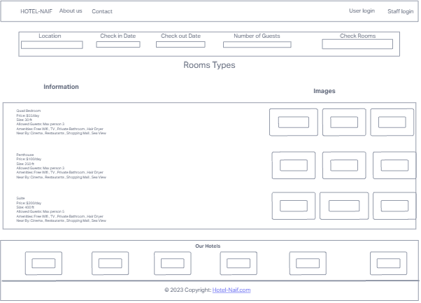

# Hotel-Naif

## Description

[Hotel-Naif](https://hotel-naif.onrender.com) is a modern hotel booking and reservation website that provides users with a seamless experience for reserving rooms in a hotel. It offers a user-friendly interface with features like user sign-up, login, room selection, booking .
Staff members have access to a management panel where they can oversee reservations, add or remove rooms, and control room availability.
This project is built using Python, Django, HTML, JavaScript, and Bootstrap, ensuring a reliable and responsive web application. With a focus on a hassle-free booking experience, Hotel-Naif caters to both users and staff members, simplifying the hotel reservation process.

------------------------------------------------------------------------------

## Technology Used

- [Python](https://en.wikipedia.org/wiki/Python_(programming_language))
- [Django](https://en.wikipedia.org/wiki/Django_(web_framework))
- [HTML](https://en.wikipedia.org/wiki/HTML)
- [JavaScript](https://en.wikipedia.org/wiki/JavaScript)
- [Bootstrap](https://en.wikipedia.org/wiki/Bootstrap_(front-end_framework))

------------------------------------------------------------------------------

## Installation

1. Install Poetry, a Python dependency management and packaging tool:
- pip install poetry

2. Install project dependencies using Poetry:
- poetry install

--------------------------------------------------------------------------------

## Running the Website

1. Navigate to the project directory: 
- cd hotel

2. Apply database migrations to set up the database:
- python manage.py migrate

3. Start the development server:
- python manage.py runserver

4. Access the website in your browser at:
- 

5. Staff login use :
- Username: naif
- Password: Test 

---------------------------------------------------------------------------------

## User Features

#### As a User, you can:

- Easily navigate through the website using the intuitive navbar, featuring options like About Us, 
  Contact, and Hotel-Naif (Home).
- Sign up and login to your account.

    - Nav Bar and Sign up , login :

    - 

- Choose your check-in and check-out dates.
- Specify the number of guests.
- Check room availability based on your preferences.

    - choose a date / Number of guests / Location /  availability :

    - 

- Browse different types of rooms, each with its own features and pricing.
- Easily book a room.
 

    - Book Your Room :

    - 

#### About Us Page

- Explore information about our hotel and team.
- Learn more about the people behind the scenes and our vision.

    - About-Us page :

    - 

#### Contact Us Page
- Contact the hotel easily through the "Contact Us" page.
- Send us a message using the contact form.
- Find our contact details for alternative communication.

    - Contact Us Form :

    - 

    - Contact details :

    - 

## Staff Features

#### As a Staff member, you can:

- Login to your staff account.
- Secure staff login with authentication.
- Staff members can create accounts via a user-friendly signup process.  

    - Staff Login (Admin Panel) :

    - 

    - Staff Signup / Login :

    - 

- Manage reservations and room availability.
- Add or remove new rooms and locations.
- Delete a room.

    - Manage reservations / Add rooms and Locations / Delete the room :

    - 

- Add new rooms with room types, capacity, price, and availability status.

    - Add new rooms :

    - 

-------------------------------------------------------------------------------

## Room Types

1. Quad Bedroom
- Price: $55/day
- Size: 30 ft
- Allowed Guests: Max 3 persons
- Amenities: Free Wifi, TV, Private Bathroom, Hair Dryer
- Nearby: Cinema, Restaurants, Shopping Mall, Sea View
  
    - 

2. Penthouse
- Price: $100/day
- Size: 250 ft
- Allowed Guests: Max 3 persons
- Amenities: Free Wifi, TV, Private Bathroom, Hair Dryer
- Nearby: Cinema, Restaurants, Shopping Mall, Sea View

    - 

3. Suite
- Price: $200/day
- Size: 400 ft
- Allowed Guests: Max 5 persons
- Amenities: Free Wifi, TV, Private Bathroom, Hair Dryer
- Nearby: Cinema, Restaurants, Shopping Mall, Sea View

    - 

-----------------------------------------------------------------------------------

## Bugs and Remaining Bugs

#### Bugs 

1. **Bug Description:** There was an issue with incorrect room availability being displayed to users. The bug caused rooms to be shown as available even when they were already reserved.

* **How bug solved:**

  - In the **'home'** view function, I needed to correct the logic that checks room availability. I was using a list of room reservations, but we needed to check each reservation to see if it overlapped with the user's requested check-in and check-out dates.

 
   - `for each_reservation in Reservation.objects.all():
    if (
        each_reservation.check_in_date < request.POST["cin"]
        and each_reservation.check_out_date < request.POST["cout"]
    ):
        pass
    elif (
        each_reservation.check_in_date > request.POST["cin"]
        and each_reservation.check_out_date > request.POST["cout"]
    ):
        pass
    else:
        room_reservations.append(each_reservation.room.id)`
        

   - Once I identified reserved rooms, I used the exclude method to exclude them from the query set of      available rooms.

 
   - `rooms = (
    Rooms.objects.all()
    .filter(
        hotel=hotels, max_capacity=int(request.POST["capacity"])
    )
    .exclude(id__in=room_reservations))`

   - By applying these changes to the code, I fixed the bug that was causing incorrect room availability to be displayed. Users now see accurate room availability based on their requested check-in and check-out dates.

2. **Bug Description:** There was an issue with editing room details on the staff panel. The bug caused the changes made to room details not to be saved.

* **How bug solved:**

  - In the **'edit_room'** view function, I identified the issue in the code that updates the room details. 
    The problem was that the wrong variable names were being used in the code.

  - `old_room = Rooms.objects.all().get(id=int(request.POST["roomid"]))
   hotel = Hotels.objects.all().get(id=int(request.POST["hotel"]))`

  - These lines should be changed to use the correct variable names:

  -  `old_room = Rooms.objects.all().get(id=int(request.POST["room_id"]))
    hotel = Hotels.objects.all().get(id=int(request.POST["hotel"]))`

  - By making these changes to the code, I fixed the bug that was causing incorrect room edits on the staff panel. Staff members can now successfully update room details, and the changes are saved as expected.

3. **Bug Description:** Attempting to sign up as a user and staff member does not work, and the application does not successfully create new accounts.

* **How bug solved:**

  - The issue lies in the **signup** code for both **users** and **staff**. The code was incorrectly checking for the existence of a user using `get_object_or_404(user, username=user_name)`. This approach is incorrect and can lead to issues.

  - Changes Made:

1. For User Signup:

  - Removed the incorrect check for user existence.
  - Used **User.objects.create_user** to create a new user.

- `try:
    user = User.objects.get(username=user_name)
    messages.warning(request, "Username Not Available")
    return redirect("userloginpage")
except User.DoesNotExist:
    new_user = User.objects.create_user(username=user_name, password=password1)
    new_user.is_superuser = False
    new_user.is_staff = False
    new_user.save()
    messages.success(request, "Registration Successful")
    return redirect("userloginpage")`

2. For Staff Signup:

  -  Removed the incorrect check for user existence.
  -  Used **User.objects.create_user** with is_staff set to True for staff accounts.

  - `try:
        user = User.objects.get(username=user_name)
        messages.warning(request, "Username Already Exists")
        return redirect("staffloginpage")
    except User.DoesNotExist:
        new_user = User.objects.create_user(username=user_name, password=password1)
        new_user.is_superuser = False
        new_user.is_staff = True
        new_user.save()
        messages.success(request, "Staff Registration Successful")
        return redirect("staffloginpage")`

#### Remaining Bugs

- None 

------------------------------------------------------------------------------------

## User Story

User stories required to implement each epic were created. These were categorised according to whether they were 'must have' features required to implement a Minimum Viable Product (MVP).
Please see the [Google sheet](https://docs.google.com/spreadsheets/d/1899SEBdH8end-S9U_1Ld0vy8ag0TXaoW/edit?usp=sharing&ouid=106045717972180530720&rtpof=true&sd=true) for detail.

------------------------------------------------------------------------------------------------

## Agile Development Methodology

In this project, I adopted an Agile methodology using GitHub. Agile was chosen for its iterative and flexible approach, enabling quick adjustments to evolving requirements. GitHub's tools, such as Issues and Projects, facilitated seamless collaboration, efficient tracking of user stories, and effective project management. The Agile methodology allowed for continuous improvement, ensuring the project's adaptability and responsiveness to changing needs.

  
  
  
  
  
  
  
  

------------------------------------------------------------------------------------------------

## Data Model

### Hotels

- `hotel_name` (CharField): Name of the hotel.
- `hotel_owner` (CharField): Owner of the hotel.
- `hotel_location` (CharField): Location of the hotel.
- `hotel_state` (CharField): State of the hotel.
- `hotel_country` (CharField): Country of the hotel.

### Rooms

- `room_type` (CharField): Type of the room (choices: Suite, Penthouse, Quad Bedroom).
- `max_capacity` (IntegerField): Maximum capacity of the room.
- `room_price` (IntegerField): Price of the room.
- `room_size` (IntegerField): Size of the room.
- `hotel` (ForeignKey to Hotels): Reference to the hotel to which the room belongs.
- `availability_status` (CharField): Availability status of the room (choices: Available, Not Available).
- `room_number` (IntegerField): Number of the room.

### Reservation

- `check_in_date` (DateField): Check-in date of the reservation.
- `check_out_date` (DateField): Check-out date of the reservation.
- `room` (ForeignKey to Rooms): Reference to the reserved room.
- `guest` (ForeignKey to User): Reference to the guest making the reservation.
- `booking_id` (CharField): Unique identifier for the booking.

### ContactMessage

- `name` (CharField): Name of the person sending the message.
- `email` (EmailField): Email address of the person sending the message.
- `message` (TextField): Content of the message.

### User

- Standard Django User model for authentication.

--------------------------------------------------------------------------------

## Wire Frame

  
  
  
  

--------------------------------------------------------------------------------

## Credits

- [getform.com](https://getform.com/): The "Send Us a Message" form code was adapted from [getform.com](https://blog.getform.io/how-to-create-an-html-form-that-sends-you-an-email/).

- [Coding for All | Newton School](https://www.youtube.com/watch?v=kG0tw2QBqjE): Valuable insights and ideas about the booking system were obtained from the "Coding for All" tutorial on YouTube by Newton School.

- [Medium](https://medium.com/@great4christ2009/building-hotel-management-system-in-django-6ce524200ac4): Additional information and concepts related to the hotel management system were explored on Medium.

- These resources played a significant role in shaping the development of Hotel-Naif.

-------------------------------------------------------------------------------------------
# Testing

   Please refer to the [TESTING.md](TESTING.md) file for all test-related documentation.

  -----------------------------------------------------------------------------------------------

  ## Live Demo

 - Check out the live demo [Live Demo](https://hotel-naif.onrender.com)

------------------------------------------------------------------------------------------------

## Deployment

This project can be easily deployed using [Render](https://render.com), a cloud platform that simplifies the deployment process.

### Prerequisites

1. **Render Account:**

   - Ensure you have a Render account. If not, you can sign up at [Render](https://render.com).

### Deployment Steps

#### 1. Clone the Repository

`git clone https://github.com/NaifZaghmout/Hotel.Naif.git`

`cd hotel`

2. **Install Dependencies**

Ensure that all necessary dependencies are installed. You can use the following command:

`pip install -r requirements.txt`

3. **Database Setup (if applicable)**

If your application requires a database, make sure to set up and configure the database before deployment. Update the database connection settings accordingly.

4. **Start the Application**

Use Gunicorn to start the application:

`gunicorn Hotel.Naif.wsgi:application`

5. **Configure Environment Variables on Render**

During the Render service setup, you need to configure environment variables. These may include database connection strings, API keys, or other configuration values.

Navigate to the "Advanced" settings in Render.

Add the required environment variables.

6. **Deploy the Service on Render**

Follow these steps to deploy your application on Render:

  - In the Render dashboard, click "Create Web Service".
  - Choose the appropriate branch to deploy.
  - Select the environment and set the build command to pip install -r requirements.txt.
  - Set the start command to gunicorn Hotel.Naif.wsgi:application.
  - Choose the Free plan.
  - In "Advanced" settings, add environment variables if needed.

7. **Configure Additional Settings**

If your application requires additional configuration, make sure to update the corresponding settings in the Render dashboard.

8. **Add Build and Start Commands in Render**

In the Render dashboard under "Settings," you can find the "Build Command" and "Start Command" sections. Ensure they are configured as follows:

  - Build Command: pip install -r requirements.txt

  - Start Command: gunicorn Hotel.Naif.wsgi:application

9. **Monitor and Debug (Optional)**

Render provides monitoring and logging tools. Use them to monitor your application's performance and troubleshoot any issues.

#### 10. Access Your Deployed App

Once the deployment is complete, Render will generate a URL that you can use to access your live application. To visit your deployed application, simply follow the link provided by Render.

You can find the live version [here](https://hotel-naif.onrender.com).

### Learn More About Render

For detailed information about deploying and managing applications on Render, please refer to the [Render Documentation](https://render.com/docs).

The Render documentation provides comprehensive guides and tutorials covering various aspects of using Render for application deployment. Explore the documentation to learn more about setting up web services, managing databases, configuring environment variables, and other essential topics.

If you have specific questions or encounter issues during the deployment process, the Render documentation is a valuable resource for finding solutions and best practices.
