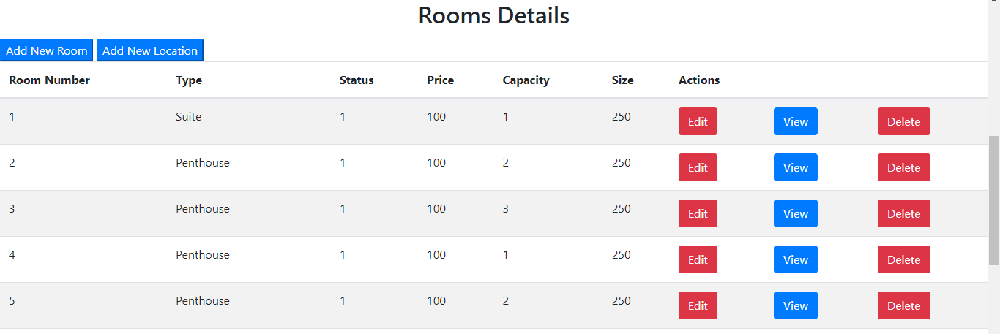

# Testing

## Manual Testing

### Navigation Bar

#### Hotel-Naif

| # | User Actions                             | Expected Results            | Y/N | Comments                              |
|---|------------------------------------------|------------------------------|-----|---------------------------------------|
| 1 | Click on **Hotel-Naif** in the navbar.   | Redirected to the home page. | Y   | View available rooms and book a room. |

#### About Us

| # | User Actions                         | Expected Results              | Y/N | Comments                         |
|---|--------------------------------------|--------------------------------|-----|----------------------------------|
| 1 | Click on **About Us** in the navbar. | Redirected to the About Us page. | Y   | Read information about the hotel. |

#### Contact

| # | User Actions                           | Expected Results                | Y/N | Comments                                      |
|---|----------------------------------------|----------------------------------|-----|-----------------------------------------------|
| 1 | Click on **Contact** in the navbar.    | Redirected to the Contact page.  | Y   | View contact information and send a message. |

### User Signup

| # | User Actions                                | Expected Results              | Y/N | Comments                 |
|---|---------------------------------------------|--------------------------------|-----|--------------------------|
| 1 | Click on **Signup (User)** in the navbar.   | Redirected to the User Signup page. | Y   | Fill in the signup form. |

### User Login

| # | User Actions                                | Expected Results              | Y/N | Comments                 |
|---|---------------------------------------------|--------------------------------|-----|--------------------------|
| 1 | Click on **Login (User)** in the navbar.    | Redirected to the User Login page. | Y   | Fill in the login form.  |

### Staff Signup

| # | User Actions                                | Expected Results               | Y/N | Comments                 |
|---|---------------------------------------------|---------------------------------|-----|--------------------------|
| 1 | Click on **Signup (Staff)** in the navbar.  | Redirected to the Staff Signup page. | Y   | Fill in the signup form. |

### Staff Login

| # | User Actions                                | Expected Results               | Y/N | Comments                 |
|---|---------------------------------------------|---------------------------------|-----|--------------------------|
| 1 | Click on **Login (Staff)** in the navbar.   | Redirected to the Staff Login page. | Y   | Fill in the login form. |

## Room Booking

### Book a Room

| # | User Actions                             | Expected Results            | Y/N | Comments                              |
|---|------------------------------------------|------------------------------|-----|---------------------------------------|
| 1 | Click on **Book a Room**.                | Redirected to the room booking page. | Y   | - |
| 2 | Fill in the location field.              | Location is filled.         | Y   | - |
| 3 | Select a date for Check-in.              | Date is selected.           | Y   | - |
| 4 | Select a date for Check-out.             | Date is selected.           | Y   | - |
| 5 | Enter the number of persons.             | Number of persons is entered. | Y   | - |
| 6 | Click on **Check Availability**.         | View available rooms.       | Y   | - |
| 7 | Click **Book** for your selected room.   | Confirmation message for the booked room. | Y   | - |

## Contact Page

### Contact Information

| # | User Actions                             | Expected Results            | Y/N | Comments                              |
|---|------------------------------------------|------------------------------|-----|---------------------------------------|
| 1 | Click on **Contact** in the navbar.      | Redirected to the Contact page. | Y   | - |
| 2 | View the address on the Contact page.    | Address is displayed.       | Y   | - |
| 3 | View the phone number on the Contact page.| Phone number is displayed.  | Y   | - |
| 4 | View the Instagram page link.            | Instagram link is displayed.| Y   | - |
| 5 | View the email address on the Contact page.| Email address is displayed.| Y   | - |

### Send Message Form

| # | User Actions                             | Expected Results            | Y/N | Comments                              |
|---|------------------------------------------|------------------------------|-----|---------------------------------------|
| 1 | Fill in your name in the form.           | Name is filled.             | Y   | - |
| 2 | Fill in your email address in the form.  | Email address is filled.    | Y   | - |
| 3 | Fill in your message in the form.        | Message is written.         | Y   | - |
| 4 | Click on **Submit**.                     | Confirmation message that your message has been sent. | Y   | - |

## Staff Dashboard

### Room Management

#### Edit Room

| # | User Actions                             | Expected Results            | Y/N | Comments                              |
|---|------------------------------------------|------------------------------|-----|---------------------------------------|
| 1 | Log in as staff.                         | Redirected to the staff dashboard. | Y   | - |
| 2 | Click on **Rooms** in the Django administration page.| Redirected to the room management page. | Y   | - |
| 3 | Click on the room to edit.               | Redirected to the edit form for the selected room. | Y   | - |
| 4 | Modify the room status.                  | Status is updated.          | Y   | - |
| 5 | Modify the room price.                   | Price is updated.           | Y   | - |
| 6 | Click on **Save**.                       | Changes are saved, and confirmation message is received. | Y   | - |

#### View Room

| # | User Actions                             | Expected Results            | Y/N | Comments                              |
|---|------------------------------------------|------------------------------|-----|---------------------------------------|
| 1 | Log in as staff.                         | Redirected to the staff dashboard. | Y   | - |
| 2 | Click on **Rooms** in the Django administration page.| Redirected to the room management page. | Y   | - |
| 3 | Click on the room to view.               | Redirected to a page displaying details of the selected room. | Y   | - |

#### Delete Room

| # | User Actions                             | Expected Results            | Y/N | Comments                              |
|---|------------------------------------------|------------------------------|-----|---------------------------------------|
| 1 | Log in as staff.                         | Redirected to the staff dashboard. | Y   | - |
| 2 | Click on **Rooms** in the Django administration page.| Redirected to the room management page. | Y   | - |
| 3 | Click on the room to delete.             | If the room is booked, show a message "Room is booked and cannot be deleted." | Y   | - |
| 4 |                                           | If the room is not booked, show a confirmation message and delete the room. | Y   | - |

#### View Dashboard Statistics

| # | User Actions                             | Expected Results            | Y/N | Comments                              |
|---|------------------------------------------|------------------------------|-----|---------------------------------------|
| 1 | Log in as staff.                         | Redirected to the staff dashboard. | Y   | - |
| 2 | View the total number of rooms.          | Total rooms count is displayed. | Y   | - |
| 3 | View the number of available rooms.      | Available rooms count is displayed. | Y   | - |
| 4 | View the number of unavailable rooms.    | Unavailable rooms

## Testing User Stories

### As a User :

| User Actions | Expected Results | Y/N | Comments |
| ------------ | ----------------- | --- | -------- |
| **Sign Up**   |                   |     |          |
| 1. Click on Login button | Redirected to Login & Sign Up form | Y |                            |
| 2. Enter valid username | Field only accepts valid username | Y |                              |
| 3. Enter valid password | Field only accepts valid passwords | Y |                             |
| 4. Enter valid password confirmation | It has to be the same as the entered password | Y |     |
| 6. Click on the Sign Up button | Confirmation message for successful signup it will take you to Login Page | Y |  |
| 7. Click "Logout" in the navbar | Takes user to the home page, showing a logout message | Y |  |
| **Log In**   |                   |     |          |
| 1. Click on Login button | Redirected to Login page | Y |  |
| 2. Enter valid username | Field only accepts valid username | Y |                                      |
| 3. Enter valid password | Field only accepts valid passwords | Y |                                     |
| 4. Click on the Login button | Confirmation message for successful login | Y |  |
| 5. Click "Logout" in the navbar | Takes user to the home page, showing a logout message | Y |  |
| **Navbar**   |                   |     |          |
| 1. Click "Naif-Hotel" | Redirected to the home page | Y |  |
| 2. Click "About Us" | Redirected to the About Us page | Y |  |
| 3. Click "Contact" | Redirected to the Contact page with contact info and a message form | Y | |
| **Contact Page** |               |     |          |
| **Send us a message form** |    |     |  |
| 1. Enter name, email, and message, then click "Submit" | Confirmation message for message submission | Y |  |

### Book a Room

| # | User Actions                             | Expected Results            | Y/N | Comments                              |
|---|------------------------------------------|------------------------------|-----|---------------------------------------|
| 1 | Go to the **Hotel-Naif** home page.      | Redirected to the home page with room details and the necessary fields to fill for booking (e.g., location, check-in/out dates, number of persons). | Y   |  |
| 2 | Observe the room images and information on the home page. | Room images and details are displayed. | Y   |  |
| 3 | Fill in the location field.              | Location is filled.         | Y   |                   |
| 4 | Select a date for Check-in.              | Date is selected.           | Y   |                   |
| 5 | Select a date for Check-out.             | Date is selected.           | Y   |                   |
| 6 | Enter the number of persons.             | Number of persons is entered. | Y   |  |
| 7 | Click on **Check Availability**.         | View available rooms.       | Y   |  |
| 8 | Click **Book** for your selected room.   | Confirmation message for the booked room. | Y   |  |

### As a Staff :

| Staff Actions          | Expected Results                                  | Y/N | Comments                                            |
| ----------------------- | -------------------------------------------------- | --- | ---------------------------------------------------- |
| **Sign Up**             |                                                  |     | Comments                                            |
| 1. Click on the Login button | Redirected to Login & Sign Up form                        | Y   | -            |
| 3. Enter valid username  | Field only accepts valid username                 | Y   |           |
| 4. Enter valid password  | Field only accepts valid passwords                | Y   |            |
| 5. Enter valid password confirmation | Must match the entered password        | Y   |        |
| 6. Click on the Sign Up button | Confirmation message for successful signup   | Y   | -       |
|                         |                                                  |     |                                                      |
 **LogIn**              |                                                  |     |                                                      |
| 1. Click on Login button | Redirected to Login page                           | Y   | -              |
| 2. Enter valid username  | Field only accepts valid username                 | Y   |           |
| 3. Enter valid password  | Field only accepts valid passwords                | Y   |              |
| 4. Click on the Login button | It will take you to the staff panel   | Y   | -       |
| 5. Click "Logout" in the navbar | Takes staff to the home page, showing a logout message | Y | -                    |
|                         |                                                  |     |                                                      |
| | **Navbar**              |                                                  |     |                                                      |
| 1. Click 'Dashboard'    | Redirected to the Room Stats page                  | Y   | -                |
| 2. Scroll down to see Rooms Details | Rooms' details displayed with Room Number, Type, Status, Price, Capacity, Size, and Actions (Add Room, Add Location, Edit, View, and Delete) | Y | -            |
| 3. Click 'Add New Room' | Redirected to a form with fields for adding a new room, including Type, Capacity, Price, Size, Status, and Location | Y | -             |
| 4. Fill out the form and click 'Add Room' | New Room Added Successfully               | Y   | -    |
| 5. Click 'Add New Location' | Redirected to a form with fields for adding a new location, including Owner, City, State, and Country | Y | -         |
| 6. Fill out the form and click 'Add Location' | Location Added Successfully           | Y   | - |
| 7. Click 'Edit'         | Redirected to the Edit Room page with a form to fill out Room Number, Room Type, Capacity, Price, Size, Status, and Location | Y | -                |
| 8. Click 'Save'         | Confirmation message to confirm the edit          | Y   | -   |
| 9. Click 'View'         | Redirected to a page displaying details of the selected room, including Number, Type, Capacity, Size, Status, City, State, and Country | Y | -        |
| 10. Click 'Delete'      | If the room is not booked, it will be deleted with a confirmation message; if booked, a message will inform that the room is booked and cannot be deleted | Y | -        |

# Automated testing

- To run the tests for this project, execute the following commands : **python manage.py test**

- 

# Validation

## CSS Validation:

- No errors or warnings were found when passing through the official [W3C](https://jigsaw.w3.org/css-validator/#validate_by_input) validator.

- 

- 

## HTML Validation:

- No errors or warnings were found when passing through the official [W3C](https://validator.w3.org/#validate_by_input) validator.

- 

## Python Validation:

- Python Validation was done by using [PEP8 CI](https://pep8ci.herokuapp.com/#)

- **You may encounter linter warnings about lines of code exceeding the recommended maximum length. These long lines are intentionally kept for better code readability and structure. They do not affect the functionality or correctness of the code. Modifying them might compromise the clarity of the code, and, therefore, they are left as is.**

- 
- 
- 
- 
- 
- 
- 

# Lighthouse Report

- 
- 
- 
- 

